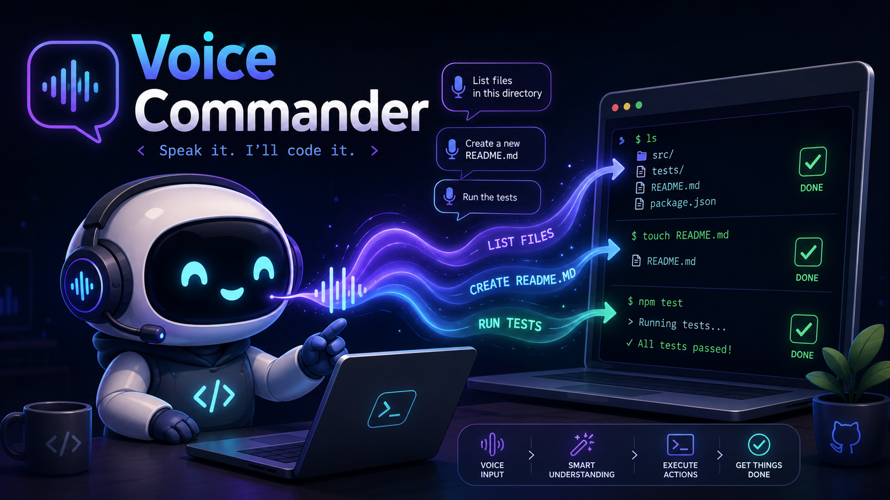

<div align="center">



<br>

**Local voice input for developers: speak, transcribe locally, and paste at the cursor.**

[](#quick-start--linux--nvidia-gpu)
[](#how-it-works)
[](#configuration)
[](LICENSE)

[Install](#quick-start--linux--nvidia-gpu) • [Demo](#demo) • [How it works](#how-it-works) • [Status](#current-state)

</div>

## What is Voice Commander

> *Speak instead of typing.*

Voice Commander records speech, transcribes it locally with `whisper.cpp`, and pastes the result at the active cursor.

The current primary path is Linux with an NVIDIA GPU. Optional Gemini refinement can remove dictation noise and restructure the transcription before it is pasted.

**Proof available now:** the working Linux implementation, a setup-check script, and the recorded demo below. There is **no small one-command installer or prebuilt bundle today**; setup still requires building `whisper.cpp` and downloading a model.

## Quick start — Linux + NVIDIA GPU

Clone both repositories:

```bash
git clone https://github.com/MasihMoafi/Voice-commander.git
cd Voice-commander
git clone https://github.com/ggerganov/whisper.cpp.git
```

Build `whisper.cpp` with CUDA:

```bash
cmake -S whisper.cpp -B whisper.cpp/build -DGGML_CUDA=ON -DCMAKE_BUILD_TYPE=Release
cmake --build whisper.cpp/build --config Release -j"$(nproc)"
```

Download the model expected by the current Linux script:

```bash
bash whisper.cpp/models/download-ggml-model.sh medium.en
```

Install Python dependencies:

```bash
python -m pip install sounddevice scipy numpy pyperclip pynput python-dotenv google-genai
```

Check the local setup:

```bash
chmod +x Linux/test_setup.sh
./Linux/test_setup.sh
```

Run:

```bash
python Linux/portable_commander_gpu.py
```

Expected result: press **F8**, **F9**, or **Right Ctrl** to start/stop recording; the transcription is copied and pasted into the active application.

## Demo

[demo.mp4](demo.mp4)

The demo is evidence of the recorded workflow, not a benchmark of transcription accuracy or latency across hardware.

## The problem

For long prompts, notes, and terminal instructions, typing can become the slowest part of getting an idea into an agent or editor. General dictation tools also tend to preserve filler words and transcription artifacts that are inconvenient in technical prompts.

Voice Commander removes that specific friction by combining local speech-to-text with direct cursor insertion and optional post-processing.

## How it works

```text
microphone
   ↓
16 kHz audio capture
   ↓
whisper.cpp / medium.en
   ↓
raw transcription
   ↓
optional Gemini refinement
   ↓
clipboard
   ↓
active terminal/editor
```

The current Linux implementation:

- records microphone audio with `sounddevice`;
- invokes the locally built `whisper-cli` executable;
- requires an NVIDIA GPU in the primary Linux path rather than silently falling back to CPU;
- optionally sends the **transcribed text**, not the audio, to Gemini when refinement is enabled;
- pastes with `Ctrl+V` or `Ctrl+Shift+V` depending on the focused application and `VC_PASTE_MODE`.

## Configuration

Copy the example environment file:

```bash
cp .env.example .env
```

For optional Gemini refinement:

```bash
GEMINI_API_KEY=your-api-key-here
VC_ENABLE_LLM=true
VC_LLM_FORMAT=xml
```

Supported output-format values in the current Linux script:

| Variable | Values | Purpose |
| --- | --- | --- |
| `VC_ENABLE_LLM` | `true` / `false` | Enable or disable Gemini post-processing |
| `VC_LLM_FORMAT` | `plain` / `xml` / `json` | Shape of refined text |
| `GEMINI_API_KEY` | API key | Required only when refinement is enabled |
| `VC_PASTE_MODE` | `auto` / `ctrl_v` / `ctrl_shift_v` | Paste-key behavior |

Without `GEMINI_API_KEY`, the Linux implementation falls back to the local Whisper transcription.

## Current state

### Implemented

- Linux microphone recording and hotkey control.
- CUDA-backed `whisper.cpp` transcription using `ggml-medium.en.bin`.
- Clipboard insertion into the active application.
- Terminal-aware paste-key selection on X11.
- Optional Gemini text refinement with plain/XML/JSON output modes.
- Local setup diagnostics in [`Linux/test_setup.sh`](Linux/test_setup.sh).

### Implemented but not continuously verified

- The repository has local diagnostic/test scripts, but no CI currently proves end-to-end microphone → Whisper → refinement → paste behavior on a clean machine.
- Desktop/window behavior depends on the local Linux environment. The terminal-detection helper is specifically X11-aware.

### Planned / unresolved

- Easier packaging and installation. The current dependency footprint makes a simple downloadable bundle impractical without additional packaging work.
- Broader platform acceptance testing.
- Multi-language support.
- Additional refinement-provider options only when there is a maintained implementation path.

### Not claimed as supported today

- A one-command install.
- A small standalone binary/package.
- Verified macOS support.
- Verified Windows end-to-end support.
- CPU fallback in the primary Linux GPU script.

There are Windows-specific files in the repository, but this README does not present them as a verified release path without current acceptance evidence.

## What sets the design apart

These are implementation choices, not novelty claims:

- **Local transcription:** microphone audio is processed through local `whisper.cpp`.
- **Optional cloud refinement:** only the transcription text is sent to Gemini when enabled.
- **Cursor-first workflow:** output is intended to land directly where the developer is already typing rather than in a separate transcription UI.
- **Fail-closed GPU path:** the current Linux GPU script explicitly checks for NVIDIA availability rather than silently changing execution mode.

## Evals and test series

Run the setup diagnostic:

```bash
./Linux/test_setup.sh
```

It checks Python, required Python imports, NVIDIA/CUDA availability, the compiled Whisper executable, and the expected model file.

What that proves: the required local pieces are present and the expected GPU executable/model paths exist.

What it does **not** prove: microphone quality, transcription accuracy, Gemini availability, paste behavior in every desktop environment, or cross-platform support.

`Linux/test_llm_integration.py` targets an older Ollama/Qwen refinement path and should not be treated as verification of the current Gemini path.

The smallest useful missing test is an automated smoke test around a fixed WAV fixture that verifies Whisper output and the current refinement adapter without requiring live microphone input.

## Example

```text
Input:  "um so like I want to [NOISE] create a function that uh calculates fibonacci"
Output: <prompt><task>Create a function that calculates the Fibonacci sequence</task></prompt>
```

This is an example of the refinement transformation, not a guaranteed output for every model response.

## Future development

The main adoption blocker is installation, not another feature list. The next useful work is a smaller, reproducible distribution path with clean-machine verification before expanding the product surface.

## License

MIT — see [LICENSE](LICENSE).